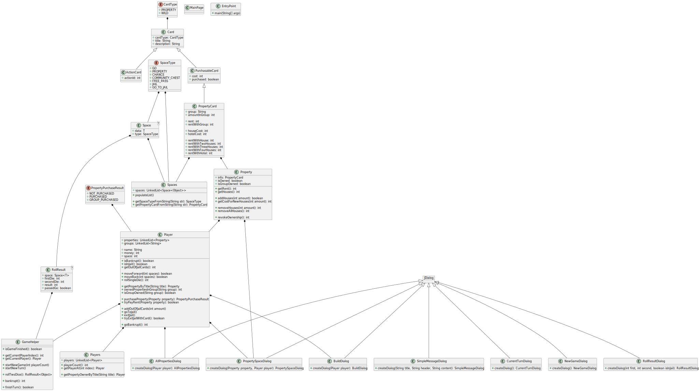

# j_monopoly
A version of the board game Monopoly, made in Java. By Camilo Heras, Omar Plata Salas.

## Minimum requirements
- [x] Add class diagram
- [x] Use linked lists for property data
- [x] Add name, cost and rent to the property data
- [x] Add player object with needed attributes
- [x] Add multiplayer (at least 2 to 4 players)
- [x] Add dice rolling
- [x] Use files to save community chest and chance cards
- [x] Implement community chest and chance cards
- [x] Implement property selling
- [x] Implement rent payments

## Class diagram

